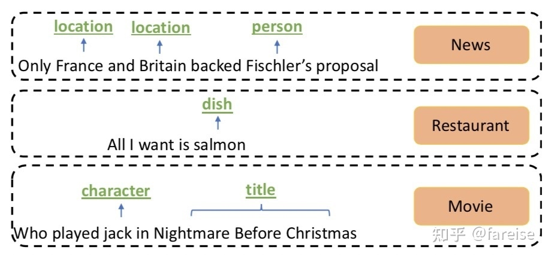
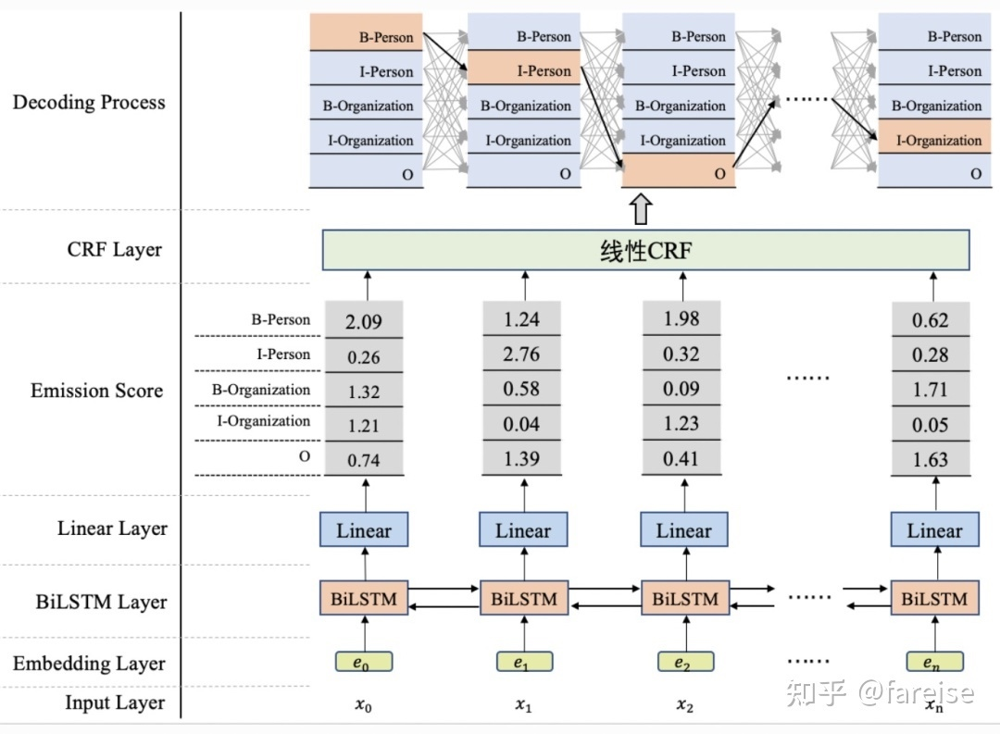
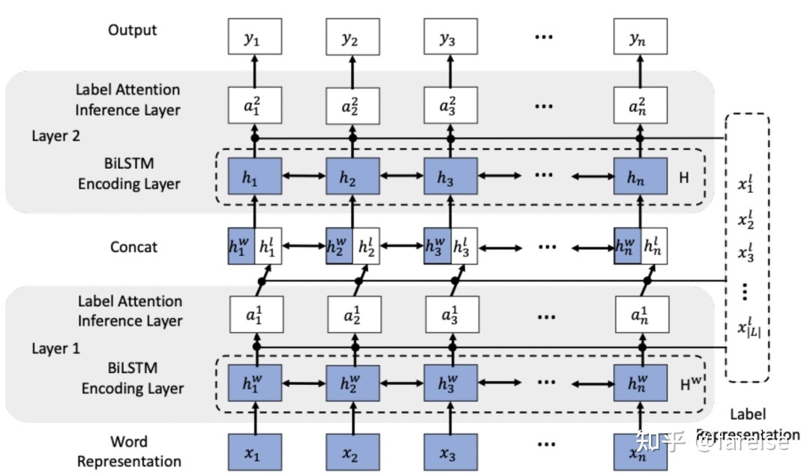

大家都知道，LSTM已经可以胜任序列标注问题了，为每个token预测一个label（LSTM后面接:分类器）；而CRF也是一样的，为每个token预测一个label。但是，他们的预测机理是不同的。CRF是全局范围内统计归一化的条件状态转移概率矩阵，再预测出一条指定的sample的每个token的label；LSTM（RNNs，不区分here）是依靠神经网络的超强非线性拟合能力，在训练时将samples通过复杂到让你窒息的高阶高纬度异度空间的非线性变换，学习出一个模型，然后再预测出一条指定的sample的每个token的label。
作者：知乎用户
链接：https://www.zhihu.com/question/35866596/answer/236886066
来源：知乎
著作权归作者所有。商业转载请联系作者获得授权，非商业转载请注明出处。

既然LSTM都OK了，为啥researchers搞一个LSTM+CRF的hybrid model? 哈哈，因为a single LSTM预测出来的标注有问题啊！举个segmentation例子(BES; char level)，plain LSTM 会搞出这样的结果：
```shell
input: "学习出一个模型，然后再预测出一条指定"
expected output: 学/B 习/E 出/S 一/B 个/E 模/B 型/E ，/S 然/B 后/E 再/E 预/B 测/E ……
real output: 学/B 习/E 出/S 一/B 个/B 模/B 型/E ，/S 然/B 后/B 再/E 预/B 测/E ……
```
看到不，用LSTM，整体的预测accuracy是不错indeed, 但是会出现上述的错误：在B之后再来一个B。这个错误在CRF中是不存在的，因为CRF的特征函数的存在就是为了对given序列观察学习各种特征（n-gram，窗口），这些特征就是在限定窗口size下的各种词之间的关系。然后一般都会学到这样的一条规律（特征）：B后面接E，不会出现E。这个限定特征会使得CRF的预测结果不出现上述例子的错误。当然了，CRF还能学到更多的限定特征，那越多越好啊！
好了，那就把CRF接到LSTM上面，把LSTM在timestep上把每一个hiddenstate的tensor输入给CRF，让LSTM负责在CRF的特征限定下，依照新的loss function，学习出一套新的非线性变换空间。最后，不用说，结果还真是好多了呢。


LSTM的优点是能够通过双向的设置学习到观测序列（输入的字）之间的依赖，在训练过程中，LSTM能够根据目标（比如识别实体）自动提取观测序列的特征，但是缺点是无法学习到状态序列（输出的标注）之间的关系，要知道，在命名实体识别任务中，标注之间是有一定的关系的，比如B类标注（表示某实体的开头）后面不会再接一个B类标注，所以LSTM在解决NER这类序列标注任务时，虽然可以省去很繁杂的特征工程，但是也存在无法学习到标注上下文的缺点。相反，CRF的优点就是能对隐含状态建模，学习状态序列的特点，但它的缺点是需要手动提取序列特征。所以一般的做法是，在LSTM后面再加一层CRF，以获得两者的优点。


简单说就是条件随机场可以把label的上下文学出来。
举个例子，每个词都有词性，LSTM只是去学会这个词是什么性质的，而crf负责学会句子中主谓宾这种语法结构


我理解B-LSTM+CRF模型，所谓在LSTM上面套CRF其实是不严谨的说法，假如这样说，那实际上是两层sequence model了吗。我认为其实是说把LSTM和CRF融合起来。比如LSTM的产出只有发射概率，尽管这个发射概率考虑到了上下文，因为LSTM有门机制，可以记忆或者遗忘前面内容，然后双向，有前有后这样，但是毕竟没有转移概率，像CRF HMM这种，都是结合发射概率和转移概率的。比如在词性标注，最简单BIO这样，有显而易见的规则，就是B-X后面不会有I-Y。所以干脆搞出B-LSTM+CRF，结合发射概率和转移概率这样。实际上后面接的CRF并不是真的CRF，比如它又没有特征模板，它又不接受离散特征，他只是一次Viterbi推导而已。

这个说的非常对，在训练过程中LSTM只是学习了观测序列到标注序列列的发射概率，CRF学习了标注序列的转移得分矩阵。预测时，利用训练好的参数先是通过LSTM得到观测序列每个token对于每一种标注的发射概率，再结合CRF的转移得分矩阵，通过维特比算法求得最终概率最高的序列为标注序列


有道理，恐怕是很多人不了解标准CRF的定义，才会认为LSTM-CRF就是完全的CRF，其实对CRF来说，特征模板设计是很重要的一块，这里都阉割了


RF侧重描述各个子团上的概率乘积可以代表大团上的概率，反映在计算方式上是序列数据各个时刻的非规范概率的加法（exp约束下），CRF在这个基础上加了一个条件变量x, 但仍然遵勖rf的理论框架，即用局部概率乘积描述整体概率。各种概率名词，包括转移概率，发射概率等，都是计算/优化过程的中间产物，计算目标都是log似然，为了让当前模型的期望数值回归到样本的真实数值。如果从计算的角度看，LSTM比传统的CRF更能体现中间计算的细节，比如前后项算法，给前后项算法加上人为定义的物理概念，我们把它理解成为局部路径概率。如果放在LSTM的节点上，更好的理解方式是按照该节点的计算结果对目标变量y的全空间路径做划分，此刻经过该节点（准确来讲应该是相邻节点）的所有路径共享本节点数值，从而达到降低计算量的效果，对比模板CRF，就是将原来先沿着序列长度计算，再沿着模板函数加权计算，转换成所有模板函数在不同的序列位置上做计算，LSTM在各个节点上的输出结果可以就可以理解成为不同模板在该节点上的特征数值的加权和。

以NER任务为例讲解一下为什么LSTM后要接CRF
## 什么是NER任务？
NER即命名实体识别任务，主要目的是识别出一个句子中的实体词，以及其对应的实体类型。比如下面的例子中，就是不同场景下的NER任务。在不同场景中，需要识别的实体类型也是不同的。



NER任务的基本解决方法当成一个序列分类任务，一般采用BIO、BIOES等标注预测方法，这里主要介绍BIO标注方法。BIO标注方法，就是给句子中的每一个单词都标注一个标签，这个标签由两部分组成：一部分是该单词所属实体的位置，其中B表示该单词是实体的第一个单词，I表示该单词是实体的中间单词，O表示不是实体；另一部分是该单词对应的实体类型，例如在上面的News类型NER任务中，就需要预测单词属于location还是person。因此，最终每个单词都被标注为BIO+实体类型的形式，这是一个文本序列分类任务。


## NER任务的一般解法
解决NER问题最经典的深度学习模型结构是百度于2015年的论文Bidirectional LSTM-CRF models for sequence tagging（2015）提出的LSTM-CRF架构。单独的LSTM其实就可以完成序列标注任务，利用LSTM对输入句子进行编码，最后得到每个单词的各个分类结果的打分。但是，只用LSTM的问题是，没有办法学到输出标签之间的依赖关系。例如B-person后面经常跟着的是I-Person这种输出标签的规律，在LSTM中感知较弱。因此，一般会在LSTM后面加一个CRF层。CRF指的是我们有一个隐变量序列和一个观测序列，每个观测值只和该时刻的隐变量以及上一时刻的观测值有关。CRF的目标就是学习隐变量到观测值的发射概率，以及当前观测值和下一个观测值之间的转移概率。LSTM-CRF中，CRF建模了NER标签之间的转移关系，弥补了LSTM在这方面的不足。CRF的核心作用就是建模label之间的依赖关系。LSTM-CRF的整体结构如下图所示。




在LSTM-CRF模型结构的基础上可以使用其他方式进行改进，例如将文本的编码器LSTM替换为Bert，或者将CRF替换成Softmax。例如Portuguese Named Entity Recognition using BERT-CRF（2020）采用了Bert-CRF的模型结构解决NER任务。对于CRF部分，Hierarchically-Refined Label Attention Network for Sequence Labeling（2019）提出采用label embedding结合多层attention机制学习各个位置label之间的关系。相比CRF模型，这种方法可以建模更复杂的label之间关系。



用CRF是为了将label之间的关系也能用的上，即是对整个隐含状态建模
CRF中的特征函数一般有点函数和边函数，前者可以理解为隐含状态到观测状态的发射概率，这个概率分布可以由RNN建模得到，而边函数则是隐含状态之间的转移概率，是需要进行学习的参数.


For sequence labeling (or general structured prediction) tasks, it is beneficial to consider the corelations between labels in neighborhoods and jointly decode the best chain of labels for a given input sentence. For example, in POS tagging an adjective is more likely to be followed by a noun than a verb, and in NER with standard BIO2 annotation I-ORG cannot follow I-PER. Therefore, we model label sequence jointly using a conditional random field (CRF), instead of decoding each label independently.


## REFERENCES
- [命名实体识别详解之一](https://zhuanlan.zhihu.com/p/88544122)
- [MECT——基于多元数据的中文NER涨点神器](https://zhuanlan.zhihu.com/p/410326937)
- [知乎：热门ner文章](https://www.zhihu.com/topic/19648557/hot)
- [实体识别：CRF及LSTM+CRF](https://blog.csdn.net/weixin_42486623/article/details/118164370?utm_medium=distribute.pc_relevant.none-task-blog-2~default~baidujs_baidulandingword~default-0.pc_relevant_default&spm=1001.2101.3001.4242.1&utm_relevant_index=3)
- [LSTM+CRF中LSTM和CRF各有什么作用](https://blog.csdn.net/zkq_1986/article/details/108291835)
- [如何理解LSTM后接CRF](https://www.zhihu.com/question/62399257)
- [信息抽取(Information Extraction:NER(命名实体识别),关系抽取)](https://zhuanlan.zhihu.com/p/67613067)


