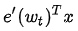
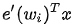
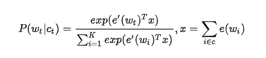

## Word2Vec的优化

### 分层softmax(Hierachical Softmax)

Hierachical Softmax的基本思想就是首先将词典中的每个词按照词频大小构建出一棵Huffman树，保证词频较大的词处于相对比较浅的层，词频较低的词相应的处于Huffman树较深层的叶子节点，每一个词都处于这棵Huffman树上的某个叶子节点；第二，将原本的一个$V$分类问题变成了$\log(V)$次的二分类问题，做法简单说来就是，原先要计算$$P({W}_{t}|C_t)$$的时候，因为使用的是普通的$softmax$，势必要求词典中的每一个词的概率大小，为了减少这一步的计算量，在Hierachical Softmax中，同样是计算当前词$W_t$在其上下文中的概率大小，只需要把它变成在Huffman树中的路径预测问题就可以了，因为当前词$W_t$在Huffman树中对应到一条路径，这条路径由这棵二叉树中从根节点开始，经过一系列中间的父节点，最终到达当前这个词的叶子节点而组成，那么在每一个父节点上，都对应的是一个二分类问题（本质上就是一个LR分类器），而Huffman树的构造过程保证了树的深度为$\log(V)，所以也就只需要做$\log(V)次二分类便可以求得$$P({W}_{t}|C_t)$$的大小，这相比原来$V$次的计算量，已经大大减小了

### 负采样
负采样的思想，也是受了C&W模型中构造负样本方法启发，同时参考了Noise Contrastive Estimation (NCE)的思想，用CBOW的框架简单来讲就是，负采样每遍历到一个目标词，为了使得目标词的概率$$P({W}_{t}|C_t)$$最大，根据softmax函数的概率公式，也就是让分子中的 
最大，而分母中其他非目标词的 
最小，普通softmax的计算量太大就是因为它把词典中所有其他非目标词都当做负例了，而负采样的思想特别简单，就是每次按照一定概率随机采样一些词当做负例，从而就只需要计算这些负采样出来的负例了，那么概率公式便相应变为

仔细和普通softmax进行比较便会发现，将原来的$V$分类问题变成了$K$分类问题，这便把词典大小对时间复杂度的影响变成了一个常数项，而改动又非常的微小，不可谓不巧妙。

## REFERENCES 

- [深入浅出Word2Vec原理解析](https://zhuanlan.zhihu.com/p/114538417)
- [Word2Vec推导详解](https://zhuanlan.zhihu.com/p/136247620)
- [Word2Vec详解](https://www.cnblogs.com/hellojamest/p/11184143.html)
- [小白都能理解的通俗易懂word2vec详解](https://www.matools.com/blog/190423603)
- [联合概率、边缘概率、条件概率之间的关系&贝叶斯公式](https://blog.csdn.net/tick_tock97/article/details/79885868)
- [word2vec中的负采样与分层softmax](https://zhuanlan.zhihu.com/p/88874759)
- [全面解读Word2Vec、Transformer和BERT](https://zhuanlan.zhihu.com/p/96778666)

